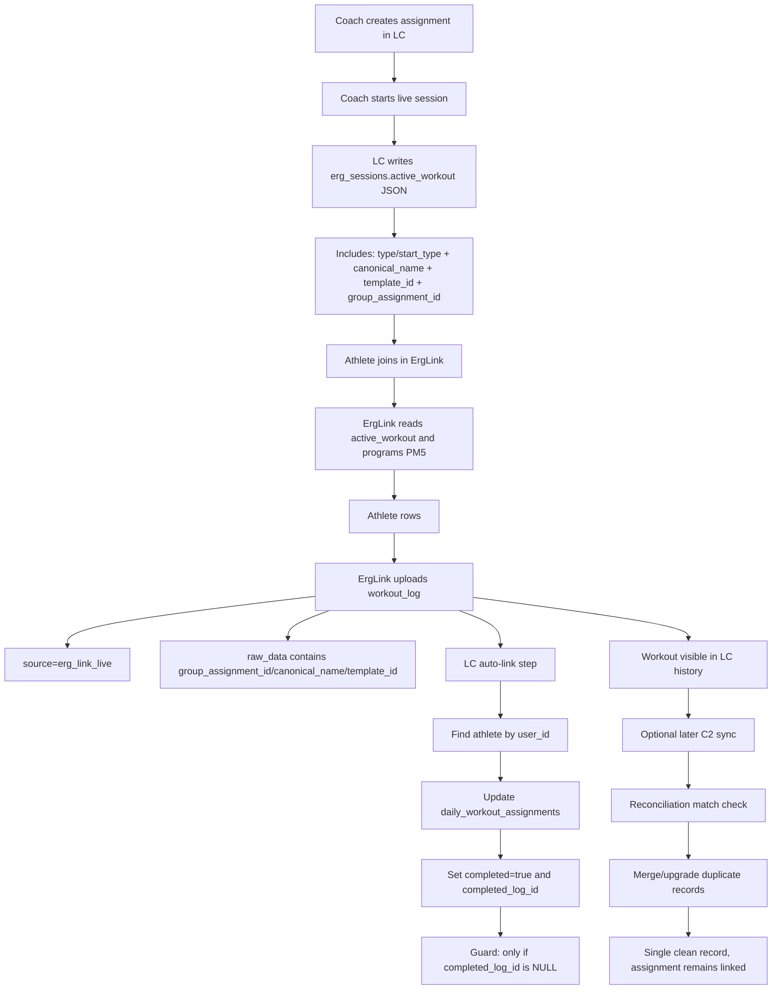

# ErgLink Assignment Completion Flow

## Mermaid Diagram



## ASCII Diagram

```text
+-------------------------------+
| Coach creates assignment (LC) |
+---------------+---------------+
                |
                v
+-------------------------------+
| Coach starts live session     |
+---------------+---------------+
                |
                v
+------------------------------------------------------+
| LC writes erg_sessions.active_workout                |
| - workout config (type/start_type)                   |
| - canonical_name                                     |
| - template_id                                        |
| - group_assignment_id  <-- key for assignment link   |
+---------------+--------------------------------------+
                |
                v
+-------------------------------+
| Athlete joins ErgLink         |
+---------------+---------------+
                |
                v
+-------------------------------+
| ErgLink reads active_workout  |
| and programs PM5              |
+---------------+---------------+
                |
                v
+-------------------------------+
| Athlete rows                  |
+---------------+---------------+
                |
                v
+------------------------------------------------------+
| ErgLink uploads workout_log                          |
| source = 'erg_link_live'                             |
| raw_data has: group_assignment_id, canonical_name... |
+---------------+--------------------------------------+
                |
                v
+------------------------------------------------------+
| LC auto-link assignment                              |
| 1) find athlete by user_id                           |
| 2) update daily_workout_assignments                  |
| 3) set completed=true + completed_log_id             |
| 4) guard: only if completed_log_id is NULL           |
+---------------+--------------------------------------+
                |
                v
+-------------------------------+
| Assignment shows completed    |
+---------------+---------------+
                |
                v
+-------------------------------+
| Optional later C2 sync        |
+---------------+---------------+
                |
                v
+-------------------------------+
| Reconciliation merge/upgrade  |
| (dedupe same workout records) |
+-------------------------------+
```

## Notes

- ErgLink knows it is assignment-linked only when `group_assignment_id` is present in `active_workout`.
- `group_assignment_id` is strongest for assignment completion; `canonical_name` helps matching/reconciliation context.
- C2 sync is not required for initial assignment completion from ErgLink uploads.
